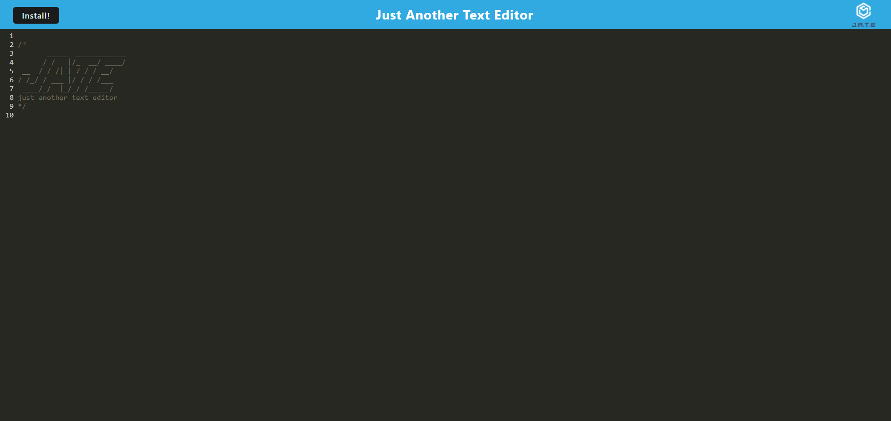

# JATE PWA

## Table of Contents
* [Description](#description)
* [Installation](#installation)
* [Usage](#usage)
* [Tests](#tests)
* [Contributing](#contributing)
* [License](#license)
* [Questions](#questions)

## Description
As a developer, I want to create notes or code snippets with or without an internet connection, so that I can reliably retrieve them for later use. Now I will be able to do so using the JATE application that can be installed. I built this project to test my knowledge of PWAs. I learned more about using webpack and indexedDB.

## Installation
Simply go to the JATE web application and click the 'Install' button in the top left corner.

## Usage
You can create notes or code snippets by simply editing the document. You can also Install the application onto your device by clicking the 'Install' button in the top left corner of the page.

## Tests
I tested this application through trial and error.

## Contributing
Andria Goodwin

## License
This project is covered under the MIT license. To learn more about what this means, click the license button at the top.

## Questions
If you have any questions, please feel free to reach me at andria.goodwin1@gmail.com or visit my GitHub profile @ https://github.com/andria-goodwin